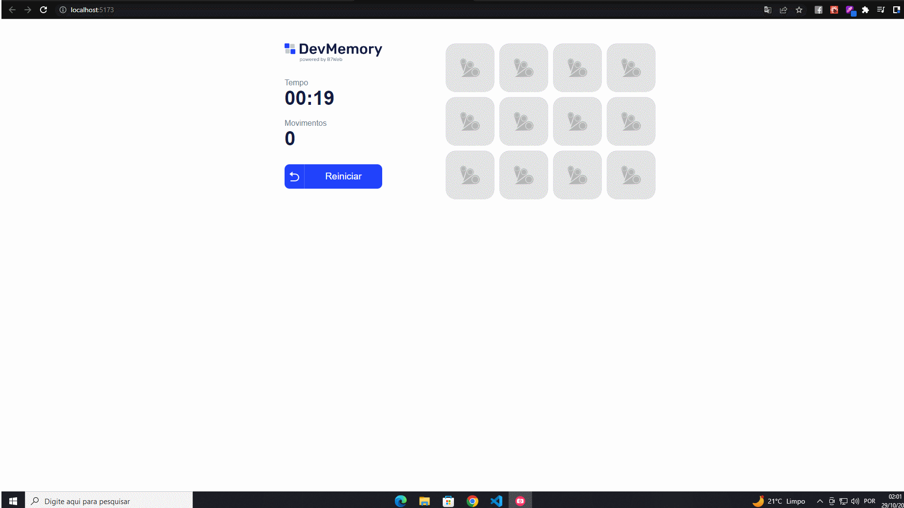

<h1 align="center">
        
    <p> Jogo da Memória 🎮</p>
</h1>

## 📕 Sobre

    Projeto realizado junto ao curso da B7WEB, utilizando React e Typescript, praticando bastante styled-components.

## 🔨 Ferramentas

- [Javascript](https://developer.mozilla.org/en-US/docs/Web/JavaScript)
- [Typescript](https://www.typescriptlang.org/docs/)
- [React](https://reactjs.org/docs/getting-started.html)
- [Styled-Components](https://styled-components.com/docs)

## 🔧 Contribua com este projeto

```
    # Clone o projeto
    $ git clone https://github.com/NatanVinicius/react-memoria.git

```

```
    # Entre no diretório
    $ cd react-memoria

```

```
    # Instale as depêndencias
    $ npm install

```
